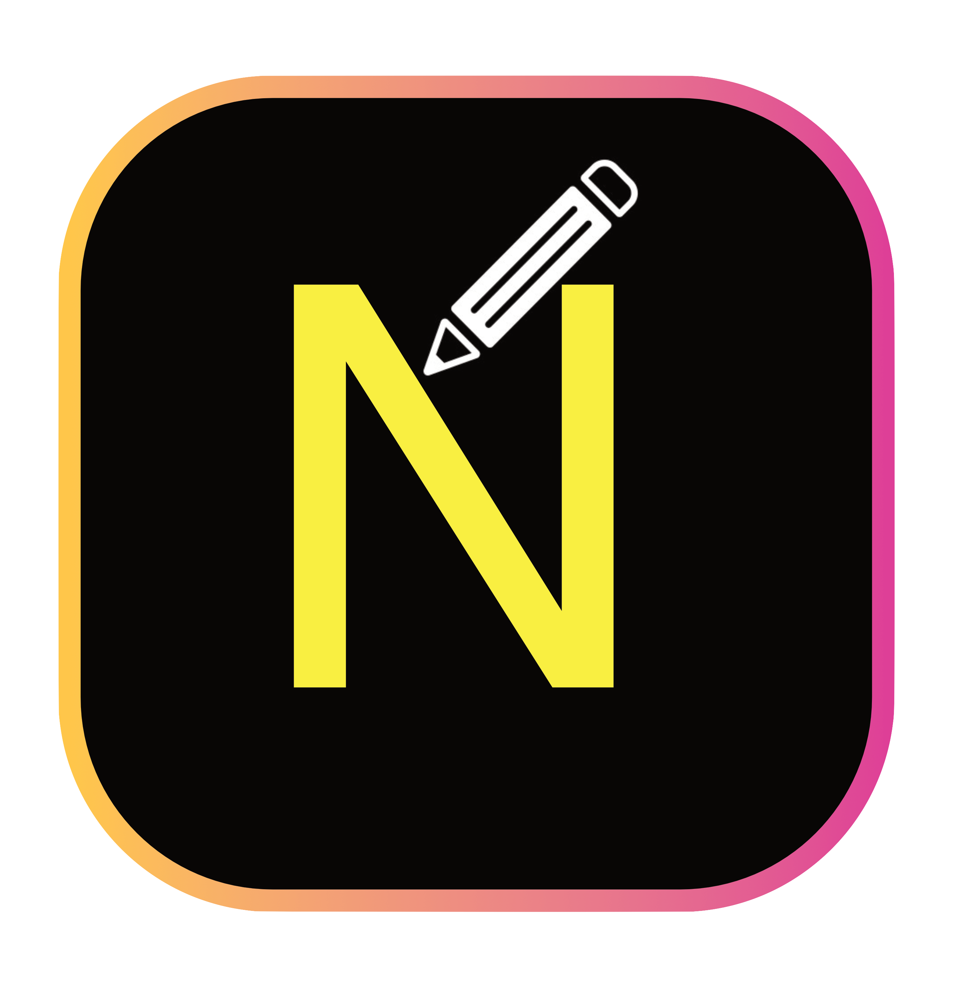

<h1> NOTI </h1>

## Features

- To be able to submit your own notes in order to create questions that you can study through.
- Connect with others that share the same the course as you!
- Create your own account so that all your notes and progress is saved!
- Have access to notes and questions that other students have submitted!

## Prerequisites
Since our website in hosted through a domain, till the time you have a working machine with internet access, you can access our website! If you'd like to have it locally,

### Ensure you have met the following requirements: 
- You have installed the latest version of ` Node.js `
- You have a ` Windows/Linux/Mac ` machine. 
- You have installed the latest ` npm `
- You have installed the latest ` git `

## Installation
- For local host:

- For Windows, verify that Node.js is installed by typing in ` node -v ` into the terminal 
- For Mac OS, verify that Node.js is installed by typing ` node -v ` // The command we ran tests the version of Node.js that's currently. The version of Node.js that's installed. 
- Update the version of npm by typing ` $ sudo npm install npm --global // Update thenpmCLI client `
- type ` echo 'export PATH=/usr/local/bin:$PATH' >>~/.bash_profile`  to add the details in .bash_profile file permanently.
- Install git by typing `git install` into the terminal

## Usage
- For local host:
- Open VSCode
- Open the command prompt
- Clone the repository through github to gain access to all the files
- Go into the terminal and type "npm start" to make the project run
- If using through the domain:
- Type in the link: (add link)
- Navigate the website accordingly

